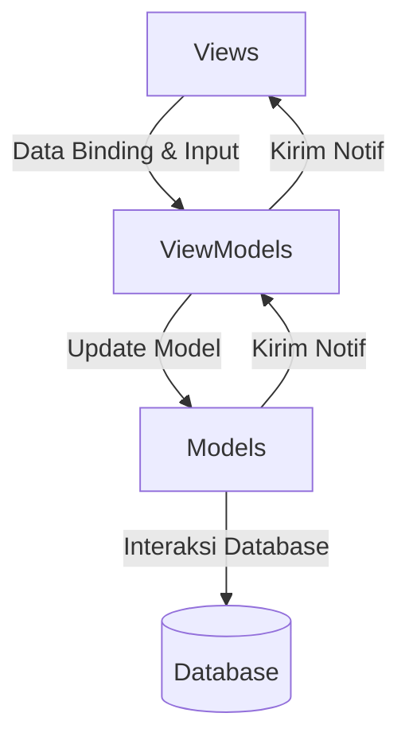

# TP10DPBO2025C1

# Janji
Saya Muhammad Ichsan Khairullah dengan NIM 2306924 mengerjakan Latihan Modul dan Tugas Praktikum 10 dalam mata kuliah Desain dan Pemograman Berorientasi Objek untuk keberkahanNya maka saya tidak melakukan kecurangan seperti yang telah dispesifikasikan. Aamiin.

# Desain Program
Program ini menggunakan arsitektur MVVM (Model-View-ViewModel) dengan struktur sebagai berikut:

1. Model Layer
Database: Menangani koneksi ke database MySQL
Kelas-Kelas Model:
- Kategori: Mengelola data kategori menu
- Menu: Mengelola data menu makanan/minuman
- Pesanan: Mengelola data pesanan
- DetailPesanan: Mengelola detail item dalam pesanan
2. ViewModel Layer
Kelas-kelas ViewModel:
- KategoriViewModel: Logic untuk operasi kategori
- MenuViewModel: Logic untuk operasi menu
- PesananViewModel: Logic untuk operasi pesanan
3. View Layer
Template:
- header.php: Layout header universal
- footer.php: Layout footer universal
Form & List:
- Form kategori, menu, dan pesanan
- List/tabel untuk menampilkan data
- Detail view untuk pesanan

# Penjelasan Alur
Berikut adalah penjelasan alur program sistem manajemen restoran Mie Gacoan yang menggunakan arsitektur MVVM (Model-View-ViewModel).

# Dokumentasi
